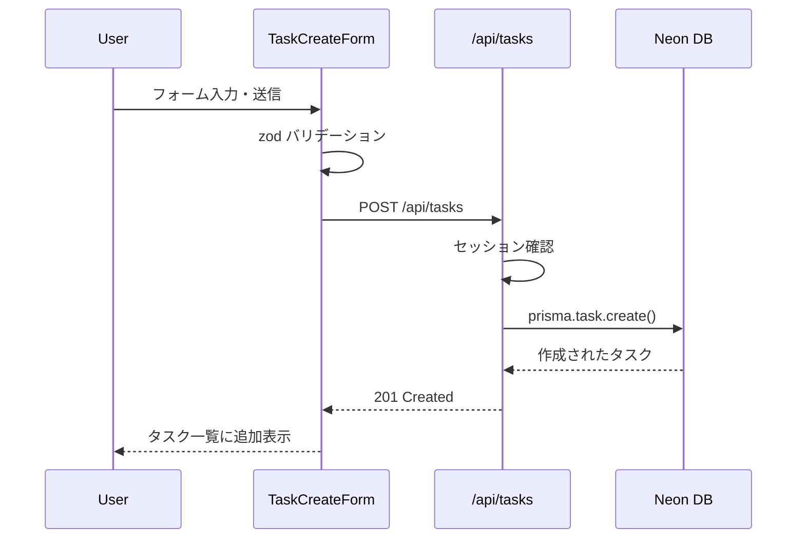

# タスク管理 要件定義

## 概要

ユーザーがタスクを登録・管理するための CRUD API と UI を提供する。
タスクには締切・予想所要時間・優先度・進捗率などを設定でき、AI スケジュール生成の入力データとなる。

## 対象フェーズ

- **Phase 1 (MVP)**: タスクの CRUD、ステータス管理、進捗記録、リスケジュールトリガー

---

## 機能詳細

### 1. タスク入力項目と詳細バリデーション

| フィールド | 型 | 必須 | バリデーション |
|-----------|---|------|--------------|
| `title` | string | ✅ | 1〜100文字 |
| `description` | string | - | 最大1000文字 |
| `deadline` | datetime | - | 現在時刻より未来 |
| `estimatedMinutes` | number | ✅ | 1〜1440（最大24時間）整数 |
| `priority` | enum | ✅ | `HIGH` / `MEDIUM` / `LOW` |

### 2. タスクステータス遷移

```
PENDING（未着手）
    │
    ▼ 作業開始
IN_PROGRESS（進行中）
    │           │
    ▼ 完了      ▼ キャンセル
  DONE       CANCELLED
```

- `progressPct` (0〜100%) は `IN_PROGRESS` 時のみ更新可能
- `DONE` に変更した場合、`progressPct` は自動的に 100 にセット
- `CANCELLED` のタスクはAIスケジュール生成の対象外

### 3. リスケジュールトリガー

- タスク詳細画面から「リスケジュール」ボタンを押すと `/api/schedule/reschedule` を呼び出す
- 対象タスク：`status` が `PENDING` または `IN_PROGRESS` の全タスク
- `progressPct` をもとに残り時間を再計算して AI に渡す（`estimatedMinutes * (1 - progressPct/100)`）

---

## API ルート仕様（`app/api/tasks/`）

### GET `/api/tasks`
全タスク一覧取得（認証ユーザーのもののみ）

**クエリパラメータ**
| パラメータ | 型 | 説明 |
|-----------|---|------|
| `status` | string | フィルター（`PENDING`, `IN_PROGRESS`, `DONE`, `CANCELLED`）|
| `priority` | string | フィルター（`HIGH`, `MEDIUM`, `LOW`）|
| `sort` | string | `deadline_asc`（デフォルト） / `priority_desc` / `created_desc` |

**レスポンス例**
```json
{
  "tasks": [
    {
      "id": "clxxx",
      "title": "企画書を書く",
      "deadline": "2026-03-01T18:00:00.000Z",
      "estimatedMinutes": 120,
      "priority": "HIGH",
      "status": "PENDING",
      "progressPct": 0,
      "calendarEventId": null,
      "scheduledStart": null,
      "scheduledEnd": null,
      "createdAt": "2026-02-25T10:00:00.000Z"
    }
  ]
}
```

---

### POST `/api/tasks`
タスク新規作成

**リクエストボディ**
```json
{
  "title": "企画書を書く",
  "description": "第1四半期の新サービス企画",
  "deadline": "2026-03-01T18:00:00.000Z",
  "estimatedMinutes": 120,
  "priority": "HIGH"
}
```

**レスポンス**
- 201: 作成したタスクオブジェクト
- 400: バリデーションエラー
- 401: 未認証

---

### GET `/api/tasks/[id]`
タスク詳細取得

**レスポンス**
- 200: タスクオブジェクト
- 404: 存在しない or 他ユーザーのタスク

---

### PATCH `/api/tasks/[id]`
タスク部分更新（ステータス変更・進捗更新・編集）

**リクエストボディ（部分更新可）**
```json
{
  "status": "IN_PROGRESS",
  "progressPct": 50
}
```

**ステータス変更時の副作用**
| 変更 | 副作用 |
|------|-------|
| → `DONE` | `progressPct` を 100 に自動セット |
| → `CANCELLED` | `calendarEventId` があればカレンダーイベントを削除（オプション） |

---

### DELETE `/api/tasks/[id]`
タスク削除

**レスポンス**
- 204: 削除成功
- 404: 存在しない or 他ユーザーのタスク

---

## UIコンポーネント設計

### コンポーネント一覧

```
components/
└── tasks/
    ├── TaskList.tsx          # タスク一覧（フィルター・ソート付き）
    ├── TaskCard.tsx          # タスク1件カード表示
    ├── TaskCreateForm.tsx    # タスク新規作成フォーム
    ├── TaskEditForm.tsx      # タスク編集フォーム
    ├── TaskDetail.tsx        # タスク詳細モーダル/ページ
    ├── TaskStatusBadge.tsx   # ステータスバッジ
    ├── TaskProgressBar.tsx   # 進捗バー（0〜100%）
    └── RescheduleButton.tsx  # リスケジュールトリガーボタン
```

### TaskList.tsx

- タスクを `priority` と `deadline` でグループ表示
- フィルタータブ（全て / 未着手 / 進行中 / 完了）
- 空状態（タスクなし）の表示

### TaskCard.tsx

- タイトル・締切・優先度バッジ・ステータスバッジを表示
- ステータスをインラインで変更できるドロップダウン
- 進捗率をスライダーまたは入力で直接編集

### TaskCreateForm.tsx

- shadcn/ui の `Dialog` を使ったモーダルフォーム
- `react-hook-form` + `zod` によるバリデーション
- 締切日時は `DatetimePicker` コンポーネントを使用

### TaskDetail.tsx

- 全フィールドの表示と編集
- 関連する `Logs`（過去のスケジュール・達成記録）の一覧
- 「リスケジュール」ボタン（`RescheduleButton`）

---

## データフロー



---

## 未決事項・考慮点

- [ ] タスクの一括操作（複数選択して削除・ステータス変更）の実装優先度
- [ ] タスクにサブタスク（親子関係）を持たせるかどうか（Phase 1 では非対応で検討）
- [ ] 締切なしタスクの扱い（AIがどう優先度付けするか）
- [ ] `calendarEventId` があるタスクを削除した場合、カレンダーイベントも削除するかの確認ダイアログ
- [ ] オプティミスティック UI の実装（ステータス変更時のレスポンス改善）
