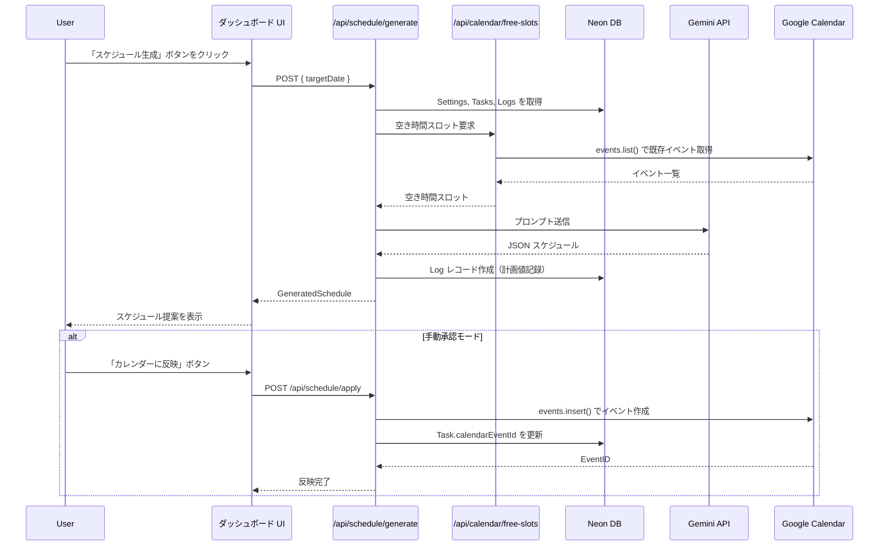

# AIスケジュール生成 要件定義

## 概要

Gemini 1.5 Flash/Pro を使用して、ユーザーのタスク・Googleカレンダーの既存予定・生活リズム設定をもとに、
1日のタイムスケジュールを自動生成する。また、進捗ズレ時の手動リスケジュールと、
Logs テーブルを活用した「見積もり精度フィードバック」機能を提供する。

## 対象フェーズ

- **Phase 1 (MVP)**: 手動トリガーでのスケジュール生成・手動リスケジュール
- **Phase 2**: Cron Job による毎朝の自動生成

---

## 機能詳細

### 1. Gemini API 呼び出し設計

#### 使用モデル
| ユースケース | モデル | 理由 |
|------------|-------|------|
| 通常のスケジュール生成 | `gemini-1.5-flash` | コスト効率・速度 |
| 複雑な制約が多い場合 | `gemini-1.5-pro` | 精度優先（オプション） |

#### SDK セットアップ（`lib/gemini.ts`）
```typescript
import { GoogleGenerativeAI } from "@google/generative-ai";

const genAI = new GoogleGenerativeAI(process.env.GEMINI_API_KEY!);

export function getGeminiModel(modelName: "gemini-1.5-flash" | "gemini-1.5-pro" = "gemini-1.5-flash") {
  return genAI.getGenerativeModel({ model: modelName });
}
```

### 2. プロンプトエンジニアリング

#### プロンプト構成（`lib/ai/buildSchedulePrompt.ts`）

AIに渡す情報を3つのブロックに整理する：

1. **ユーザー設定ブロック**（Settings テーブルから取得）
2. **タスクブロック**（Tasks テーブルの未完了タスク）
3. **空き時間ブロック**（Googleカレンダーから算出）

```typescript
export function buildSchedulePrompt(input: ScheduleInput): string {
  const { settings, tasks, freeSlots, targetDate, logs } = input;

  const personalityGuide = {
    STRICT: "タスクをぎっしり詰めて、休憩は最小限に。締切を最優先に管理してください。",
    BALANCED: "適度な休憩を挟みながら、無理のないペースでタスクを配置してください。",
    RELAXED: "余裕を持った計画を立て、バッファ時間を多めに取ってください。",
  };

  return `
あなたはプロフェッショナルなスケジュール管理AIです。
以下の情報をもとに、${targetDate}（${getDayOfWeek(targetDate)}）の最適な1日スケジュールを生成してください。

## ユーザーの生活リズム
- 起床時間: ${settings.wakeUpTime}
- 就寝時間: ${settings.bedTime}
- 昼休憩: ${settings.lunchStart} 〜 ${settings.lunchEnd}
${settings.focusTimeStart ? `- 集中タイム: ${settings.focusTimeStart} 〜 ${settings.focusTimeEnd}` : ""}
- スケジュールスタイル: ${personalityGuide[settings.aiPersonality]}
${settings.aiCustomPrompt ? `- 追加指示: ${settings.aiCustomPrompt}` : ""}

## 未完了タスク一覧
${tasks.map((t, i) => `
${i + 1}. ID: ${t.id}
   タイトル: ${t.title}
   残り所要時間: ${t.remainingMinutes}分
   優先度: ${t.priority}
   締切: ${t.deadline ? formatDateTime(t.deadline) : "なし"}
   現在の進捗: ${t.progressPct}%
`).join("")}

## 本日の空き時間スロット（Googleカレンダーの既存予定を除いた時間）
${freeSlots.map(slot => `- ${formatTime(slot.start)} 〜 ${formatTime(slot.end)}（${slot.durationMinutes}分）`).join("\n")}

${logs.length > 0 ? `
## このユーザーの過去の見積もり傾向（参考情報）
- 平均見積もり精度: ${calcAverageAccuracy(logs)}%
  （100%を超える場合は実際の作業が見積もりより長い傾向）
- 直近のズレパターン: ${summarizeLogPattern(logs)}
` : ""}

## 出力形式（必ずJSONで返すこと）
以下のJSON形式で出力してください。他のテキストは一切含めないこと。

{
  "scheduleItems": [
    {
      "taskId": "タスクのID（新規イベントはnull）",
      "title": "イベントタイトル",
      "start": "HH:MM",
      "end": "HH:MM",
      "type": "TASK | BREAK | BUFFER",
      "notes": "AIからのメモ（任意）"
    }
  ],
  "summary": "今日のスケジュール全体へのコメント（100文字以内）",
  "warnings": ["注意事項があれば記載（締切が厳しいタスクなど）"]
}
  `.trim();
}
```

### 3. スケジュール生成レスポンスの型定義

```typescript
// types/schedule.ts

export type ScheduleItemType = "TASK" | "BREAK" | "BUFFER";

export interface ScheduleItem {
  taskId: string | null;
  title: string;
  start: string;      // "HH:MM"
  end: string;        // "HH:MM"
  type: ScheduleItemType;
  notes?: string;
}

export interface GeneratedSchedule {
  scheduleItems: ScheduleItem[];
  summary: string;
  warnings: string[];
}

export interface ScheduleInput {
  settings: {
    wakeUpTime: string;
    bedTime: string;
    lunchStart: string;
    lunchEnd: string;
    focusTimeStart?: string;
    focusTimeEnd?: string;
    aiPersonality: "STRICT" | "BALANCED" | "RELAXED";
    aiCustomPrompt?: string;
  };
  tasks: Array<{
    id: string;
    title: string;
    remainingMinutes: number;
    priority: "HIGH" | "MEDIUM" | "LOW";
    deadline?: Date;
    progressPct: number;
  }>;
  freeSlots: Array<{
    start: Date;
    end: Date;
    durationMinutes: number;
  }>;
  targetDate: string;  // "YYYY-MM-DD"
  logs: Array<{
    plannedMinutes: number;
    actualMinutes: number | null;
    accuracyRatio: number | null;
  }>;
}
```

### 4. スケジュール生成 API エンドポイント

#### POST `/api/schedule/generate`
```typescript
// app/api/schedule/generate/route.ts
export async function POST(req: Request) {
  const session = await getServerSession(authOptions);
  if (!session) return Response.json({ error: "Unauthorized" }, { status: 401 });

  const { targetDate } = await req.json();
  const userId = session.user.id;

  // 1. DB から Settings・Tasks・Logs を取得
  const [settings, tasks, logs] = await Promise.all([
    prisma.settings.findUnique({ where: { userId } }),
    prisma.task.findMany({
      where: { userId, status: { in: ["PENDING", "IN_PROGRESS"] } },
      orderBy: [{ priority: "desc" }, { deadline: "asc" }],
    }),
    prisma.log.findMany({
      where: { userId },
      orderBy: { createdAt: "desc" },
      take: 20,  // 直近20件のログ
    }),
  ]);

  // 2. Google Calendar から空き時間を取得
  const freeSlots = await getFreeSlotsFromCalendar(session.accessToken!, targetDate);

  // 3. タスクの残り時間を計算
  const tasksWithRemaining = tasks.map(task => ({
    ...task,
    remainingMinutes: Math.ceil(task.estimatedMinutes * (1 - task.progressPct / 100)),
  }));

  // 4. プロンプト生成
  const prompt = buildSchedulePrompt({
    settings: settings!,
    tasks: tasksWithRemaining,
    freeSlots,
    targetDate,
    logs,
  });

  // 5. Gemini API 呼び出し
  const model = getGeminiModel("gemini-1.5-flash");
  const result = await model.generateContent(prompt);
  const responseText = result.response.text();

  // 6. JSONパース（失敗時はエラー）
  const schedule: GeneratedSchedule = JSON.parse(
    responseText.replace(/```json\n?|\n?```/g, "").trim()
  );

  return Response.json({ schedule });
}
```

#### POST `/api/schedule/reschedule`
残タスクの再計算によるリスケジュール。`generate` と同じロジックだが、
現在時刻以降の空き時間のみを対象とする。

```typescript
// 現在時刻以降の空きスロットのみを対象にする
const freeSlots = await getFreeSlotsFromCalendar(
  session.accessToken!,
  targetDate,
  new Date()  // 現在時刻をカットオフとして渡す
);
```

#### POST `/api/schedule/apply`
生成されたスケジュールをGoogleカレンダーに書き込む（手動承認時に呼び出す）

```typescript
// body: { schedule: GeneratedSchedule, targetDate: string }
// → calendar.md の書き込みフローを参照
```

### 5. Logs テーブルを活用した「見積もり精度」フィードバック

#### ログ記録のタイミング
1. スケジュール生成時 → `Log` レコードを作成（`plannedStart`, `plannedEnd`, `plannedMinutes` を記録）
2. タスク完了時 → `Log.actualMinutes`, `Log.actualProgressPct` を更新
3. `Log.accuracyRatio = actualMinutes / plannedMinutes` を計算・保存

#### フィードバックロジック（`lib/ai/analyzeUserLogs.ts`）
```typescript
export function calcAverageAccuracy(logs: Log[]): number {
  const validLogs = logs.filter(l => l.accuracyRatio !== null);
  if (validLogs.length === 0) return 100;
  const avg = validLogs.reduce((sum, l) => sum + l.accuracyRatio!, 0) / validLogs.length;
  return Math.round(avg * 100);
}

export function summarizeLogPattern(logs: Log[]): string {
  const avg = calcAverageAccuracy(logs);
  if (avg > 130) return "実際の作業時間が見積もりより30%以上長い傾向があります";
  if (avg > 110) return "実際の作業時間が見積もりより若干長い傾向があります";
  if (avg < 80) return "実際の作業時間が見積もりより短い傾向があります（見積もりに余裕があります）";
  return "見積もり精度は良好です";
}
```

---

## メインワークフロー図



---

## 未決事項・考慮点

- [ ] Gemini のレスポンスが JSON でない場合のリトライ処理（最大2回）
- [ ] `gemini-1.5-flash` と `gemini-1.5-pro` の切り替え条件（タスク数が多い場合はProを使うなど）
- [ ] スケジュール提案を複数案（3案）提示してユーザーが選ぶ UI の検討
- [ ] プロンプトのバージョン管理（プロンプト改善時の過去データとの比較のため）
- [ ] Gemini API のレートリミット対策（Phase 2 の Cron では複数ユーザー分の処理が発生）
- [ ] コスト管理：Flash モデルで月間コストを試算（1ユーザー/日 ≒ 1000トークン × 30日 = 30,000トークン）
