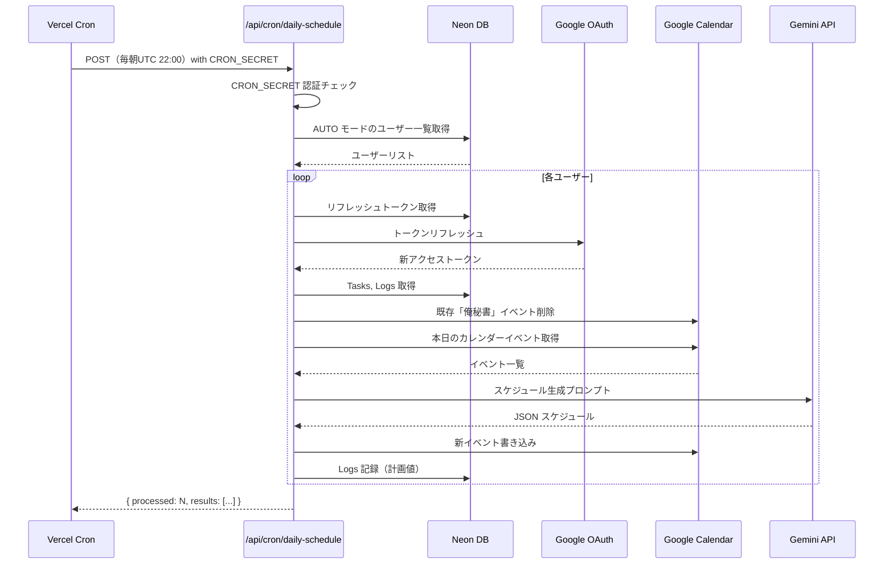

# 自動実行（Cron Job） 要件定義

## 概要

Vercel Cron Jobs を使い、毎朝指定時刻に全ユーザーのスケジュールを自動生成・カレンダーに反映する。
`CRON_SECRET` による認証でエンドポイントを保護する。

## 対象フェーズ

- **Phase 2**: Vercel Cron Jobs による自動実行

---

## 機能詳細

### 1. Vercel Cron Jobs 設定（`vercel.json`）

```json
{
  "crons": [
    {
      "path": "/api/cron/daily-schedule",
      "schedule": "0 22 * * *"
    }
  ]
}
```

**スケジュール解説**
- `"0 22 * * *"` = UTC 22:00（JST 翌日 7:00）に毎日実行
- 対象：全ユーザー（`calendarMode` の設定に関わらず生成処理を実行）
  - `AUTO` モードのユーザー → 生成後、カレンダーに自動書き込み
  - `MANUAL` モードのユーザー → 生成後、DBに保存（次回ダッシュボード表示時に提案として表示）

### 2. Cron エンドポイント設計

#### POST `/api/cron/daily-schedule`

```typescript
// app/api/cron/daily-schedule/route.ts
import { NextRequest } from "next/server";
import { prisma } from "@/lib/prisma";

export async function POST(req: NextRequest) {
  // CRON_SECRET による認証
  const authHeader = req.headers.get("authorization");
  if (authHeader !== `Bearer ${process.env.CRON_SECRET}`) {
    return Response.json({ error: "Unauthorized" }, { status: 401 });
  }

  const targetDate = getJSTDateString();  // JST の今日の日付（YYYY-MM-DD）
  const results: CronResult[] = [];

  // calendarMode: AUTO のユーザーを取得
  const autoUsers = await prisma.settings.findMany({
    where: { calendarMode: "AUTO" },
    include: { user: { include: { accounts: true } } },
  });

  for (const setting of autoUsers) {
    try {
      const result = await processUserSchedule(setting.user, setting, targetDate);
      results.push({ userId: setting.userId, status: "success", ...result });
    } catch (error) {
      results.push({ userId: setting.userId, status: "error", error: String(error) });
    }
  }

  return Response.json({ processed: results.length, results });
}
```

### 3. ユーザー別スケジュール処理フロー

```typescript
async function processUserSchedule(user: User, settings: Settings, targetDate: string) {
  // 1. DB からリフレッシュトークンを取得
  const account = user.accounts.find(a => a.provider === "google");
  if (!account?.refresh_token) throw new Error("No refresh token found");

  // 2. アクセストークンを再発行
  const accessToken = await refreshGoogleAccessToken(account.refresh_token);

  // 3. タスク・ログ取得
  const [tasks, logs] = await Promise.all([
    prisma.task.findMany({
      where: { userId: user.id, status: { in: ["PENDING", "IN_PROGRESS"] } },
      orderBy: [{ priority: "desc" }, { deadline: "asc" }],
    }),
    prisma.log.findMany({
      where: { userId: user.id },
      orderBy: { createdAt: "desc" },
      take: 20,
    }),
  ]);

  if (tasks.length === 0) {
    return { message: "No pending tasks, skipped" };
  }

  // 4. Google Calendar から空き時間を取得
  const freeSlots = await getFreeSlotsFromCalendar(accessToken, targetDate);

  // 5. スケジュール生成（Gemini API）
  const schedule = await generateScheduleWithGemini({
    settings,
    tasks: tasks.map(t => ({
      ...t,
      remainingMinutes: Math.ceil(t.estimatedMinutes * (1 - t.progressPct / 100)),
    })),
    freeSlots,
    targetDate,
    logs,
  });

  // 6. カレンダーへの自動書き込み
  //    - 既存の「俺秘書」イベントを先に削除
  await deleteOrehisyoEvents(accessToken, targetDate);
  await writeScheduleToCalendar(accessToken, schedule, targetDate, user.id);

  // 7. Logs テーブルに計画値を記録
  await recordScheduleLogs(user.id, schedule, targetDate);

  return { eventsCreated: schedule.scheduleItems.filter(i => i.type === "TASK").length };
}
```

### 4. Cron Job 専用のトークンリフレッシュ処理

Cron Job はユーザーセッションがないため、DB からリフレッシュトークンを直接取得して使う。

```typescript
// lib/auth/refreshGoogleAccessToken.ts
export async function refreshGoogleAccessToken(refreshToken: string): Promise<string> {
  const response = await fetch("https://oauth2.googleapis.com/token", {
    method: "POST",
    headers: { "Content-Type": "application/x-www-form-urlencoded" },
    body: new URLSearchParams({
      client_id: process.env.GOOGLE_CLIENT_ID!,
      client_secret: process.env.GOOGLE_CLIENT_SECRET!,
      grant_type: "refresh_token",
      refresh_token: refreshToken,
    }),
  });

  const data = await response.json();
  if (!response.ok || !data.access_token) {
    throw new Error(`Token refresh failed: ${JSON.stringify(data)}`);
  }

  return data.access_token;
}
```

### 5. セキュリティ（CRON_SECRET による認証）

#### 環境変数設定
```env
CRON_SECRET=<openssl rand -base64 32 で生成した秘密鍵>
```

#### Vercel が Cron Job を呼び出す際のリクエスト
- Vercel は `Authorization: Bearer ${CRON_SECRET}` ヘッダーを自動付与する
- ローカル開発でテストする際は手動でヘッダーを付与する

#### ローカルテスト方法
```bash
curl -X POST http://localhost:3000/api/cron/daily-schedule \
  -H "Authorization: Bearer <CRON_SECRET の値>"
```

### 6. 既存「俺秘書」イベントの削除処理

リスケジュール時に重複イベントが発生しないよう、書き込み前に俺秘書が作成したイベントを削除する。

```typescript
async function deleteOrehisyoEvents(accessToken: string, date: string) {
  const calendar = getCalendarClient(accessToken);

  const events = await calendar.events.list({
    calendarId: "primary",
    timeMin: new Date(`${date}T00:00:00+09:00`).toISOString(),
    timeMax: new Date(`${date}T23:59:59+09:00`).toISOString(),
    privateExtendedProperty: "source=orehisyo",  // 俺秘書が作成したイベントのみ
    singleEvents: true,
  });

  for (const event of events.data.items ?? []) {
    if (event.id) {
      await calendar.events.delete({ calendarId: "primary", eventId: event.id });
    }
  }
}
```

---

## 自動スケジュール生成ワークフロー図



---

## エラーハンドリング方針

| エラーケース | 対処 |
|------------|------|
| リフレッシュトークン失効 | そのユーザーをスキップしてログに記録（他ユーザーの処理は継続）|
| Gemini API タイムアウト | リトライ1回 → 失敗でスキップ |
| Calendar API エラー | スキップ＋エラーログ記録 |
| 全処理失敗 | Vercel のアラートで検知（Vercel の Cron Job ログで確認）|

---

## 環境変数

```env
CRON_SECRET=<openssl rand -base64 32 で生成>
GEMINI_API_KEY=<Google AI Studio から取得>
```

---

## 未決事項・考慮点

- [ ] 複数ユーザーの並列処理（`Promise.all` vs 逐次処理）：Gemini/Calendar のレートリミットを考慮して逐次処理を推奨
- [ ] Cron 実行ログの永続化（現在は Vercel のログのみ。将来的にはDBに保存）
- [ ] Cron 実行時刻のユーザーごとのカスタマイズ（Phase 3 以降：ユーザーが「自分の7時」を設定できるように）
- [ ] `MANUAL` モードのユーザーへの通知：生成後にダッシュボードで提案を表示する仕組み（DBに `pendingSchedule` テーブルを追加する案）
- [ ] Vercel Cron Jobs の実行保証（失敗時の再試行は Vercel が自動で行わないため、手動再実行エンドポイントを用意するか検討）
- [ ] 月間コスト試算：ユーザー100人 × 1リクエスト/日 = 100回/日 → Gemini Flash コストを計算
