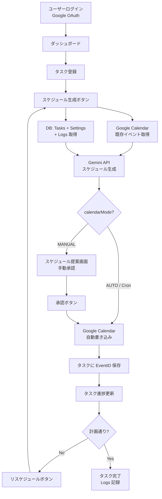

プロジェクト要件定義書：俺秘書 (My-AI-Secretary)

1. プロジェクト概要

ユーザーのタスク（課題・予定）とGoogleカレンダーをAI（Gemini）で統合管理し、毎日の最適スケジュールを自動生成・更新する「AI秘書」アプリケーション。

2. ターゲット技術スタック

Frontend/Backend: Next.js (App Router), TypeScript

Database: Neon (Postgres)

Infrastructure: Vercel (Hosting & Cron Jobs)

AI Model: Gemini 1.5 Flash / Pro (Google AI Studio)

Integration: Google Calendar API, Google Auth (NextAuth.js)

Future Extension: LINE Messaging API (Chatbot UI)

3. コア機能要件

A. スケジュール自動生成（定期実行機能）

機能: 毎朝指定の時間（例: 朝7時）に、DB内の未完了タスクとGoogleカレンダーの既存予定を取得。

AI処理: Geminiがユーザーの「生活習慣（設定値）」を考慮し、空き時間にタスクを割り振った「本日のタイムスケジュール」を提案。

カレンダー反映: AIが提案し、ユーザーが承認（または自動設定）したスケジュールをGoogleカレンダーへ書き込み。

B. タスク・進捗管理 UI

入力: タスク名、締切日時、予想所要時間、重要度をユーザーが入力。

進捗記録: ユーザーが「完了/未完了/〇%達成」を入力。

フィードバック: 計画通り進まなかった場合、UI上のボタン一つでAIが残りの時間を再計算（リスケジュール）。

C. ユーザー設定

稼働時間: 起床時間、就寝時間、昼休憩、集中タイムなどのプリセット。

性格設定: 「厳しめに管理してほしい」「余裕を持った計画がいい」などのAIの人格設定。

4. データ構造（簡易案）

AIエージェントに詳細化させるためのベース項目：

Users: Google OAuth情報、リフレッシュトークン。

Settings: 生活リズム、AIへのプロンプト指示、優先順位ロジック。

Tasks: 締切、必要時間、ステータス、GoogleカレンダーのEvent ID。

Logs: 過去の達成率（AIが「このユーザーは見積もりが甘い」と判断する材料）。

5. ワークフロー図

6. フェーズ分け

Phase 1 (MVP): Googleログイン＋タスク保存＋手動でのAIスケジュール生成。

Phase 2: Vercel Cron Jobsによる毎朝の自動スケジュール更新。

Phase 3: LINE連携による通知およびチャット形式での進捗報告・修正。